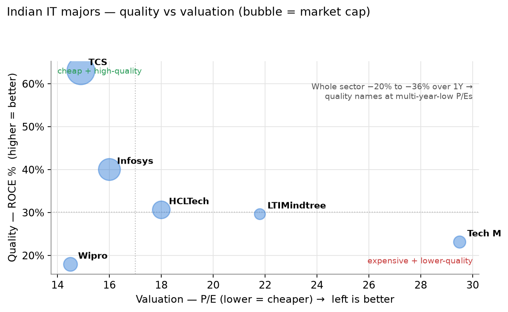
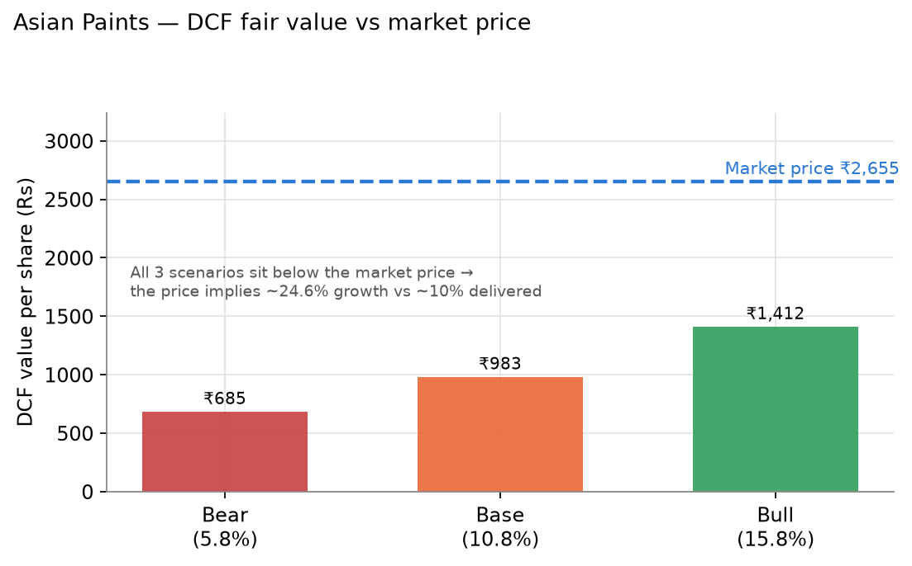
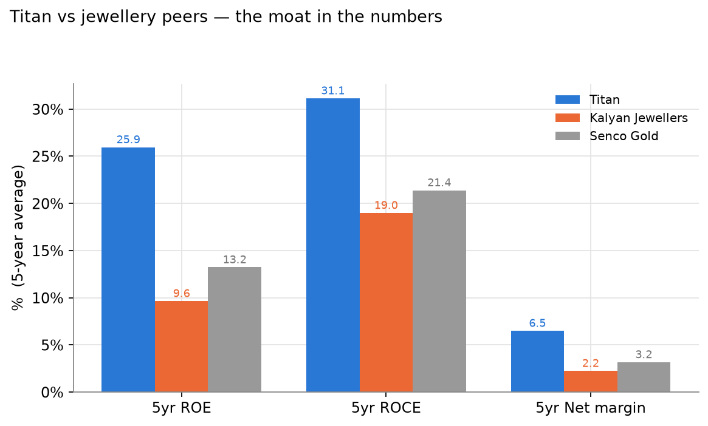
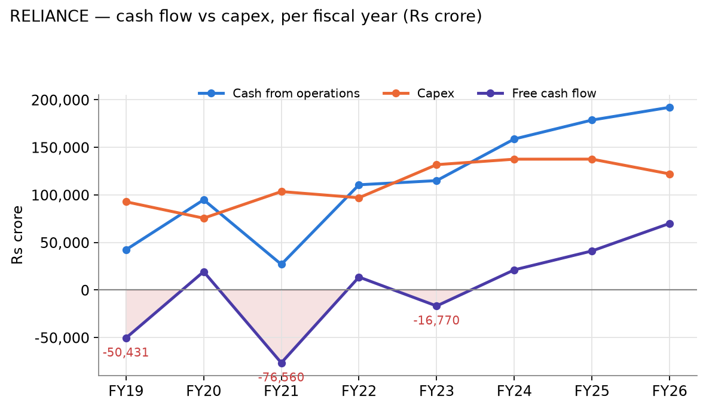
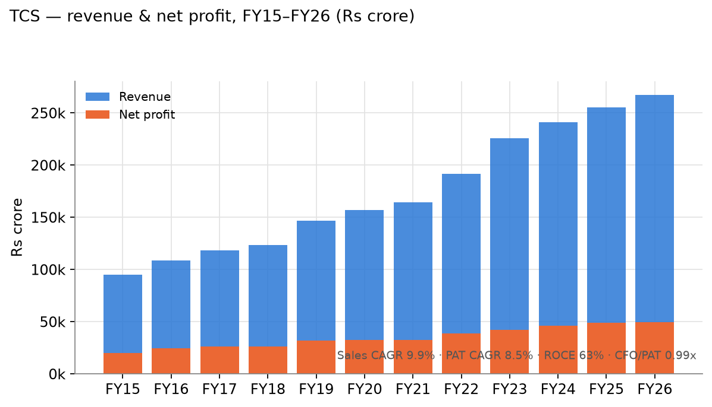
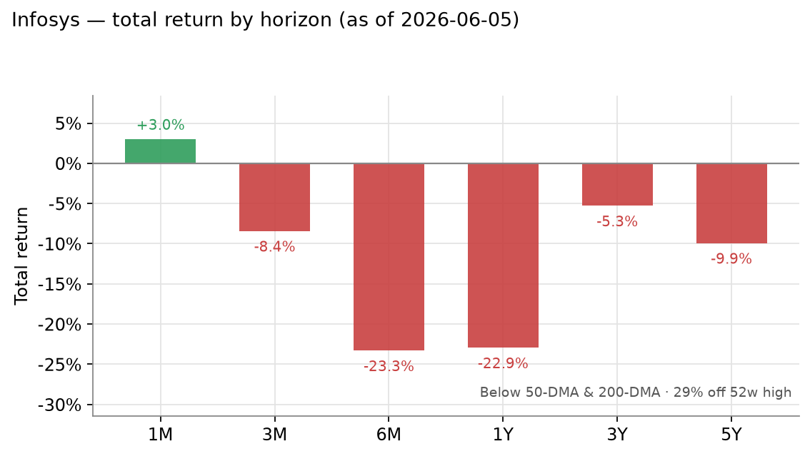
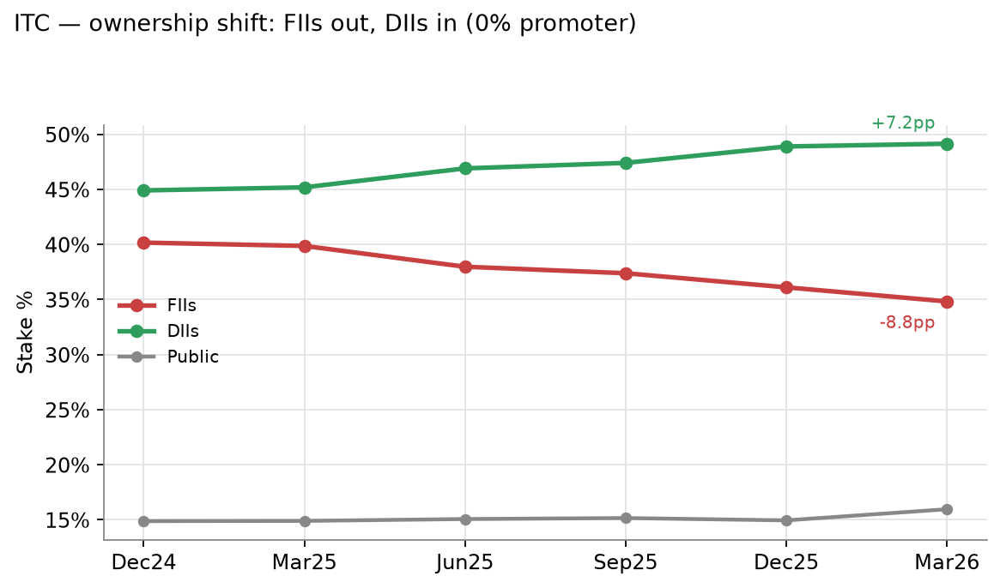

# Finance Research Agent — Indian Equities (NSE/BSE)

An AI equity-research analyst for the Indian market: 28 structured data tools + RAG over
concalls/filings + forensic-scoring skills, on the [Claude Agent SDK](https://docs.anthropic.com/en/api/agent-sdk)
and [MCP](https://modelcontextprotocol.io). It runs real analyst workflows — sector screens,
valuations, SWOTs, forensic audits — and **ranks and scores evidence rather than issuing
buy/sell calls or made-up price targets.**

> **Not investment advice.** Decision-support only. And **no third-party data is shipped in this
> repo** — you point the pipeline at your *own* accounts and it builds a *local* copy for the few
> companies you want to study. See [DISCLAIMER](DISCLAIMER.md).

---

# See it in action

Four real, multi-tool analyses. Each links to the full worked example. *(Figures are point-in-time
snapshots from a local data lake — illustrative, not advice.)*

## 1 · Sector analysis — "Is Indian IT a falling knife or a buying opportunity?"
`sector_analysis` → sector-scoped `screen_stocks` → `financial_health` on the leaders.



91 companies, ₹25.4L cr. Every major is **20–37% off its 52-week high and below its 200-DMA** — a
sector-wide de-rating — yet TCS still earns **63% ROCE / 52% ROE** at a **14.9× P/E near its
historical floor**. The agent frames the one question that decides it (AI disruption: cyclical or
structural?) and leaves the call to you. **→ [full analysis](examples/01-sector-analysis-it-services.md)**

## 2 · Valuation — "Is Asian Paints still worth 57× earnings?"
`valuation_summary` (multiples + relative + 3-scenario DCF) cross-checked vs history + Graham Number.



All three DCF scenarios land **below** the market price: the ₹2,655 quote implies **~24.6% growth
for a decade** vs the **~10% actually delivered**. High-quality business, *priced for perfection*.
Every assumption is surfaced; the output is a range, not a "target." **→ [full analysis](examples/02-valuation-asian-paints.md)**

## 3 · SWOT — Titan, with the moat quantified
`business_profile` + `competitive_position` (VRIO-tested) + `financial_health` + `valuation_summary`.



Titan earns **2–3× the ROE/ROCE of Kalyan and Senco** — a *Valuable, Rare, Organised* moat. The
SWOT still surfaces the catches: **cumulative CFO only 0.62× PAT** (working-capital drain), 92%
single-segment concentration, and a P/E of ~72–82. **→ [full analysis](examples/03-swot-titan.md)**

## 4 · Forensic audit — Deepak Nitrite, scores computed from raw statements
`financial_health` + `forensic_checks` + named scores computed from 12y of statements.

```
SCORECARD   Altman Z'' 9.84 (safe) · Piotroski 3/8 (weak) · Sloan accrual +0.15% (clean)
            Beneish M-Score: NOT COMPUTED — 4 of 8 inputs (receivables/COGS/SG&A/current-
            asset split) aren't in this data source, so the agent refuses to approximate it.
```

Three straight years of PAT decline, FCF negative two years, net debt swing of ₹1,971cr — but zero
promoter pledge and clean accruals. The audit separates *deteriorating* from *dishonest*. **→ [full
analysis](examples/04-forensic-audit-deepak-nitrite.md)**

---

## More tools, one chart each

| | |
|---|---|
| **`capital_allocation` — Reliance**<br>Heavy capex finally turning FCF-positive; net debt ₹267k cr → ₹83k cr.<br> | **`financial_health` — TCS**<br>Durable compounding, 0.99× CFO/PAT, 63% ROCE.<br> |
| **`technicals_momentum` — Infosys**<br>Below both DMAs, −23% 1Y, 29% off 52w high.<br> | **`shareholding_trends` — ITC**<br>FIIs out −8.8pp, DIIs in +7.2pp; 0% promoter.<br> |

---

## What it is

A local data lake of ~3,100 NSE/BSE companies (statements, prices, filings, concalls) exposed to
Claude as **28 MCP tools**, plus **8 research skills** (dossier, forensics, SWOT,
management-credibility, screening, ethics, risk-profiling) governed by a shared
`investing-principles` rulebook (Graham / Greenblatt / Damodaran / Coffee Can / Piotroski /
Altman / Sloan).

- 🏗️ **How it works, the tool list, engineering notes & setup →** [`docs/ARCHITECTURE.md`](docs/ARCHITECTURE.md)
- 📓 **All worked examples →** [`examples/`](examples/)

## Quickstart

```bash
conda create -n finance-ai python=3.11 && conda activate finance-ai
pip install -r requirements.txt
cp .env.template .env && cp .mcp.json.example .mcp.json   # your own cookies/paths
python scripts/04_screener_scraper.py --symbol TITAN      # fetch just what you'll study
python -m agent.finance_agent "Is Asian Paints still worth 57x earnings?"
```

Full setup in [`docs/ARCHITECTURE.md`](docs/ARCHITECTURE.md).

## Licensing

| What | License |
|---|---|
| Code (`agent/`, `scripts/`) | [Apache-2.0](LICENSE) |
| Docs, skills, prompts | [CC BY-NC-SA 4.0](LICENSE-DOCS.md) |
| Third-party data (screener/Tijori/filings) | **Not redistributed** — theirs, personal-use only |

Methodology adapts, in part, Anthropic's Apache-2.0
[`financial-services`](https://github.com/anthropics/financial-services) skills (see
[NOTICE](NOTICE)). **This project does not provide investment advice** — see [DISCLAIMER](DISCLAIMER.md).
